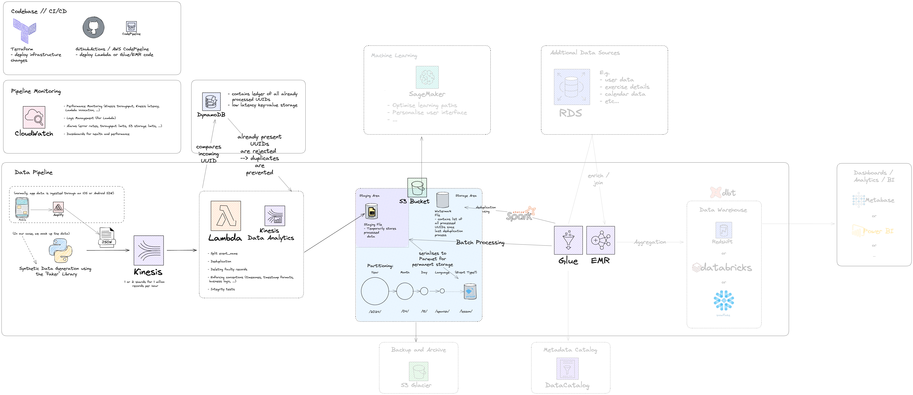

# Event Streaming Toy Example

This is a bigger project about exploring a common Data Engineering task:
how to process an **event stream** from an app. My example here is a language
learning app, but this could be any other app that uses event-based processing.

I split this project in two separate repositories, as I explored the problem
from two different angles: A toy example angle and a local mock up angle.
The architecture is basically the same in both angles, just the
level of detail of how close it is modelled to actual AWS cloud
architectures differs.

This is the toy project repository. You can find the local mock up
repository for this project [here](LINK).
TODO: Insert correct link to other repo here.

## Summary and Purpose

This project explores event processing. Every time a user logs into an app
or anything else happens on the app, an event about it is created and needs to be
processed. I.e. it needs to be received, checked if it is in the correct format,
deduplicated, and saved efficiently in real time.

I assumed this process would take place using services from the AWS cloud,
so all pipeline elements here have names that correspond to AWS services.

## Architecture overview



### Data source

We expect the data to flow in through an iOS or Android SDK, as we are dealing
with a mobile app. In our case, we are mocking up these data in the
`data_creation/producer.py` module which uses the `faker` library under the hood.

I assume a volume of **1 million events every hour**.

All events have a basic structure:

- `event_uuid`
- `created_at`
- `event_name` consisting of "`event_type`:`event_subtype`"
- event specifics that pertain to the specific event subtype, e.g. the `language_id`
  of a particular resumed game, or the score achieved in that particular attempt.

Example Event:
```
{
  "event_uuid":"d7ca46d5-80b5-4b81-bf5b-c96a60c4c573",
  "created_at":1712844605.9512355,
  "event_name":"game:resumed",
  "event_specifics":
  {
    "device":"iOS",
    "user_location":"Vernier, France",
    "attempts":93,
    "language_id":"lang_ru",
    "difficulty":"Hard",
    "score":46,
    "session_id":"937baf69-7d3e-406c-b32f-f8a937bd70f1"
  }
}
```

An overview of all event types, subtypes and their corresponding field types
can be found in the `data_creation/event_config.yml` file.

The `producer` module provides a callable function for downstream consumers
but it also provides a main function that creates some example data into the
`output/sample_events.json` file.

The data is serialised into .json and passed on to the downstream consumers.

### Event Streaming and Processing

The data is then passed into a Kinesis stream which is consumed by a Lambda function.
The Kinesis stream has 1 or maybe 2 shards, in which case the data would be partitioned by `event_uuid` to ensure equal distribution of data across shards.

>[!IMPORTANT]
>**Differences between Toy Example and Local Mock Up:**
>The **toy example** mocks up the Kinesis stream by simply
>taking the official AWS Kinesis JSON template and replacing
>the "data" portion of the payload with the generated event
>all right in the `producer.py` file.
>
>The **local mock up** mocks up an actual Kinesis stream
>through Localstack.

In the Lambda function, some basic business logic is applied to the data and it
is deduplicated using a DynamoDB, which is mocked up here as a Redis database.
The function decodes the data from base64 checks whether the `event_uuid`
already exists in the ID cache (Redis or DynamoDB). It then splits the
event_type into `event_subtype` and `event_type` and converts the `created_at`
timestamp to isoformat.

> [!IMPORTANT]
> **Differences between Toy Example and Local Mock Up:**
> The **toy example** implements the Lambda function as
> a local Python function, whereas the **local mock up** implements
> an actual Lambda function in Localstack.

### Data storage

The Lambda function stores the data as `.ndjson` files in the staging area of an S3 bucket / data lake.
The staging area is partitioned by **year, month, day, hour, and minute**. I.e. every minute, the inflowing data will be stored in a new "folder".

> [!IMPORTANT]
> **Differences between Toy Example and Local Mock Up:**
> The **toy example** stores the data in the local filesystem under the
> `output/datalake/staging` folder.
> The **local mock up** mocks an actual S3 bucket using Localstack.

### Batch processing

While the Lambda function processes incoming events in real-time, we then
batch-process the data using a Spark job that is run from an AWS Glue or AWS EMR service.

The Spark job serialises the more ephemeral `.ndjson` files from the staging
area into more permanent Parquet files, which are partitioned by **year, month,
day, and language**, thereby combining a day's worth of staging files and
clustering them by language_id
//TODO: Check discrepancy in clustering strategy between
//Architecture diagram (only by day), and actual Glue script (by hour).

> [!IMPORTANT]
> **Differences between Toy Example and Local Mock Up:**
> The **toy example** implements the Spark job as a local Python function, whereas the
> **local mock up** mocks up an AWS Glue instance in Localstack.

The Spark job writes the Parquet files to the `output/datalake/processed` folder.
//TODO: What about the Watermark file mentioned in the Architecture diagram?
//Are we just de-duplicating the batch itself in the Spark job?

From here on, the data can be processed fast and reliably, given
the versatility of Parquet files.

### Monitoring and Logging

To ensure all processes are running smoothly, a Cloudwatch instance monitors
the number of function invocations, logs all errors and warnings, and
supervises limits such as storage usage.

> [!IMPORTANT]
> **Differences between Toy Example and Local Mock Up:**
> - The **Toy Example** implements Cloudwatch as a simple `dataclass` in Python
>   in the `mock_cloudwatch.py` file. It has fields for the number of function
>   invocations, the number of ingested events, prevented duplicates, and storage
>   usage. It further has methods to write the results to Markdown into the
>   `output/cloudwatch_reports/` directory.
> - The **local mock up** example mocks an actual Cloudwatch instance.

### Deployment and CI/CD

The **local mock up** deploys infrastructure uses **Terraform** in combination
with Localstack (also known as [Terraform
Local](https://github.com/localstack/terraform-local)). It is
a simple convenience wrapper around Terraform that targets the localhost.

In real contexts, the code would be deployed using a CI/CD pipeline on e.g. Github Actions or AWS CodePipeline. For the sake of scope, I have not included this here.

### Out of scope possible further usages

With the data in the production area of the data lake, some possible future downstream consumers come to mind:

- Machine Learning through **SageMaker**, e.g. for optimising the learning
  paths or personalising the user interface
- Combining the event data with other data sources like user data, exercise
  details, or marketing/promotion data into a **data warehouse** using **dbt**
  and a **cloud data warehouse** like **AWS Redshift** or **Snowflake**. This
  allows for deeper analytics of how certain campaigns were performing and which
  languages recently grew or shrunk in user base.
- If the data lifecycle is completed, and for recovery reasons, data can be moved to long-term storages like AWS S3 Glacier.
- For profiling or to trace data lineage and pipeline troubleshooting, tools like **AWS DataCatalog** can come in handy.

## How to Run - the Toy example

### Overview

This is a toy example meant to simulate the basic principles of event stream processing. While it illustrates how a production pipeline might operate, it is simplified and not optimized for deployment on actual AWS services. Instead, it demonstrates how the pipeline handles data throughput, modeling, and file formats.

### Modules

The script is divided into four core modules:

1. **Event Producer (Mock-up Data)**: This module generates synthetic event data based on the structure defined in `event_config.yml`. Each event includes fields such as `event_uuid`, `created_at`, `event_name`, and subtype-specific fields. The mock-up uses the `faker` library to generate these fields dynamically.

- You can create sample events using:

```bash
make create-sample-data
```

This outputs the generated data as a JSON file in `output/sample_events.json`. Additionally, a Kinesis-style payload is created for use in the Lambda processor.

2. **Lambda Stream Processor**: This simulates processing events from a Kinesis stream:

   - It extracts the JSON data, processes it, and performs de-duplication using a Redis instance (mocked as a substitute for DynamoDB).
   - The processed events are saved as `.ndjson` files in the `datalake/staging/` folder, partitioned by **year, month, day, and hour**.

3. **Glue Batch Processor**: This module processes batches of data from the staging area using a simulated Spark job:

   - It loads the staged `.ndjson` files, applies further de-duplication, and writes the final data to Parquet files under `datalake/processed/`.
   - Data is partitioned by **year, month, day, and language** for efficient storage and querying.

4. **Mock CloudWatch**: A simple `dataclass` that tracks metrics such as the number of Lambda and Glue invocations, duplicates found, and data usage in the staging and processed areas. It generates a markdown report and stores it in `output/cloudwatch_reports/`.

### Running the Pipeline

You can run the entire pipeline simulation with:

```bash
make run-toy-example
```

## Architecture deepdive: Technology Choices and Rationale

- **Kinesis**: To handle **1 million events/hour** (assuming 1 KB per event), the throughput is approximately 1 GB/hour. Using the calculation:

  $$
  \frac{1,000,000,000 \text{ bytes}}{3,600 \text{ seconds}} \approx 277,778 \text{ bytes per second}
  $$

  Since each shard can process up to **1 MB/sec**, the required number of shards is:

  $$
  \frac{0.278 \text{ MB/sec}}{1 \text{ MB/sec/shard}} \approx 0.278 \text{ shards}
  $$

  Thus, **1 shard** is sufficient, though an additional shard could be used for redundancy or parallelism during peak loads.

- **Lambda**: Suitable for lightweight real-time processing of event streams. While **Kinesis Data Analytics** could handle more complex use cases, Lambda was chosen for its simplicity and compatibility with DynamoDB-based de-duplication (which **Firehose** doesn’t support).

- **DynamoDB**: A natural fit for high-volume, low-latency lookups, making it ideal for checking processed event IDs and preventing duplicates.

- **Glue/EMR**: Chosen for scalable batch processing, **Glue** is a fully managed ETL service that runs **Apache Spark** jobs. Alternatively, **EMR** offers more control over Spark environments, which might be useful for more complex tasks like combining data from multiple sources.

- **S3**: The de facto AWS solution for scalable, durable storage of unstructured data. It provides lifecycle management for archival (e.g., **S3 Glacier**).

- **NDJSON (Staging)**: Newline-delimited JSON (NDJSON) allows for fast, schema-flexible writing of event data to the staging area, avoiding the overhead of appending to JSON or enforcing a rigid schema like CSV.

- **Parquet (Storage)**: Parquet is a columnar format optimized for analytics, supporting schema evolution, efficient queries, and nested data—perfect for the project’s structured JSON-like data.

- **CI/CD**: **GitHub Actions** and **AWS CodePipeline** are both strong choices for automating code deployment and testing, with the choice typically based on organizational preference.

- **CloudWatch**: Used to track pipeline performance (e.g., Kinesis throughput, Lambda invocations, batch processing times). It also sets up alerts to monitor for spikes in latency or resource use, ensuring timely intervention.

## Architecture Deepdive: Design considerations

### Handling Duplicate Events

To manage duplicate events effectively, de-duplication can happen at two points in the pipeline:

1. **Real-time De-duplication in Lambda**: Incoming records are checked against
   a lightweight **DynamoDB** table, which stores processed `event_uuid`s. This
   early de-duplication helps reduce the number of duplicates stored in the
   staging area.
2. **Batch De-duplication in Glue/EMR**: In the batch job, de-duplication can
   be applied based on either a **time window** (e.g., deduplicating events from
   the last hour) or using a **checkpoint file** to compare event IDs and remove
   duplicates. In this sterile example where I generate my own raw data, I opted
   for the easier time window approach and only de-duplicated the current batch,
   as I kind of know that duplicates can only arise in the course of processing
   the current batch.

While de-duplication at both stages adds a layer of security, it can lead to
inconsistencies if the sources of processed UUIDs aren't properly synced. Using
just one method—especially in the Lambda function—streamlines the process, but
it could leave room for duplicates in the staging area, which would then be
handled during batch processing.

### Data Partitioning for Performance and Scalability

Data partitioning was influenced by two factors:

1. **Query Patterns**: Frequently queried data, like daily, weekly, or monthly event logs, forms the basis for partitioning. Additional business factors, such as **language**, guide how data is grouped, allowing for more focused queries, such as assessing the performance of specific language products.

2. **Data Volume**: With **1 million events per hour**, the goal was to maintain Parquet file sizes between **100 MB and 1 GB**, which are optimal for efficient querying and processing. By partitioning the data by **day and language**, we ensure well-sized files that are both manageable and queryable.

### File Formats

For this pipeline, two file formats are used:

- **NDJSON**: In the staging area, NDJSON is ideal for fast, schema-flexible writes. It’s lightweight and doesn’t require complex handling, which makes it a great fit for the real-time nature of Lambda outputs.
- **Parquet**: For permanent storage, Parquet is used due to its columnar storage format, which supports schema evolution and is optimized for large-scale querying, making it perfect for analytics.

### Testing and Reliability

Testing has so far been out of scope for this pipeline project and needs to be
added in the future. Thus, most of this paragraph is abstract and speculative.

Several levels of testing are necessary to ensure the architecture works smoothly:

- **Unit Tests**: Validate the logic of individual functions like Lambda and
  Glue, ensuring they behave as expected in a controlled environment.
- **Integration Tests**: Check if services, such as Lambda and Glue, correctly
  pass data to each other and store it in the proper partition on S3.
- **End-to-End Testing**: Evaluate the pipeline’s performance as a whole, testing
  for bottlenecks with real data inputs.
- **Performance and Load Testing**: Tools like **AWS CloudWatch Synthetics** simulate how the infrastructure performs under varying loads, helping identify latency and capacity issues.
- **Disaster Recovery Testing**: **AWS Fault Injection Simulator** can test the
  resilience of the pipeline, simulating component failures and ensuring backup
  solutions are in place.

### Scalability Across Environments

Ensuring the architecture can be replicated across environments (development, production, or different cloud providers) requires two key principles:

1. **Version-Controlled Infrastructure**: Using **Terraform** for
   Infrastructure as Code (IaC) ensures that configurations are consistent across
   environments. For example, swapping an **AWS EC2** instance for an **Azure
   Virtual Machine** would only require a few adjustments in the Terraform file.
   (Barring of course the considerable additional overhead of managing two cloud
   providers at the same time for the same project...)
2. **Shared Resource Management**: Storing shared configurations and secrets in
   tools like **AWS Secrets Manager** or **GitHub Secrets** ensures that changes
   to critical settings propagate seamlessly across environments.

Additionally, **containerization** (e.g. Docker) is useful for standardizing
versions of components like Redis across different machines, ensuring
consistency throughout the pipeline.

### Adapting to Different Data Volumes

How would I change the given architecture / pipeline if the volume of source data would significantly increase or decrease?

- **Smaller Data Volumes (1,000 events/hour)**: With lower event volume, the
  main goal would be to reduce costs while maintaining functionality. For
  example, **Kinesis** could be reduced to a single shard, and batch processing
  might be handled entirely by **Lambda** instead of more costly tools like Glue.
- **Larger Data Volumes (1 billion events/hour)**: In a high-throughput
  scenario, the architecture needs to scale efficiently. This would involve
  adding more **Kinesis shards**, fine-tuning **Lambda** functions, and
  potentially switching to **EMR** for heavier batch processing. Additionally,
  more fine-grained partitioning in S3 (e.g., by hour and event type) would help
  manage the large data sets.

### Removing Data Transformation by switching to Firehose

Even if data transformation isn’t needed, key steps like validation and
serialization are still crucial. A potential simplification could involve using
**Kinesis Firehose** to store raw events directly in S3, with deduplication
deferred to batch processing later. However, the overall structure of the
pipeline would remain largely the same.
